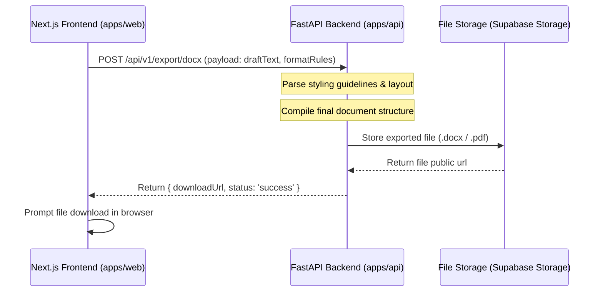

# Backend Export Architecture Plan

This document outlines the architectural plan for exporting draft templates into final files (DOCX, PDF) in subsequent releases.

## V1 Export Model: Browser Printing
In the initial release (V1), users can print the generated drafts directly using the web browser's print engine:
- **Client-Side printDraft()**: Calls the native `window.print()` API.
- **Isolate Styles**: Uses print-specific CSS media styles (`@media print`) to hide non-document components (navbar, sidebar selectors, metadata cards, validation checks, warnings list, action buttons) and display only the document sheet.
- **A4 formatting**: Preserves font scaling, line spacing, and paragraph line breaks.

---

## Future Backend Export Model
For downstream releases, file exports (DOCX/PDF) will be computed and processed securely in the FastAPI backend.

### Key Principles:
1. **Preserve Final Draft**: The backend export must receive the final, validated, and advocate-edited text from the frontend. It should not re-run the AI generation.
2. **No Double AI Billing**: AI compilation only runs once during the intake prompt preview phase. File exports read the resulting state and compile it directly.
3. **Format Customizations**: Future backend engines will support state-specific templates, court stamp margin alignments, spacing guidelines, and header formatting.
4. **Current Certification Disclaimer**: The V1 preview layout is not certified for direct Uttar Pradesh court filing and should be reviewed manually before print.
