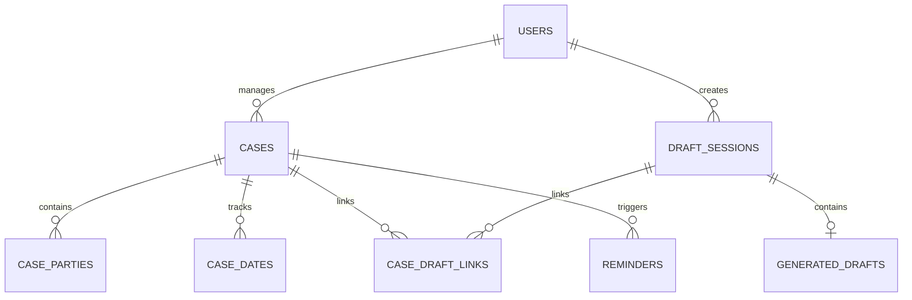

# Schema Specifications: Level 13 Drafting & Case Management

This document details the database schema layout designed for the Supabase PostgreSQL migration.

## ER Diagram (Core Entities)

---

## 1. Core Drafting Persistence Tables

### `users`
- Tracks advocate accounts.
- Fields:
  - `id`: uuid, PK
  - `email`: varchar, unique
  - `password_hash`: varchar
  - `full_name`: varchar
  - `role`: varchar (e.g. `advocate`, `associate`)
  - `created_at` / `updated_at`: timestamptz

### `draft_blueprints`
- Registry stores templates configurations.
- Fields:
  - `id`: uuid or varchar, PK
  - `draft_type`: varchar
  - `title`: varchar
  - `metadata`: jsonb (stores sections inputs layout)

### `draft_sessions`
- Keeps active user form answers.
- Fields:
  - `id`: uuid, PK
  - `user_id`: uuid, FK -> `users.id`
  - `blueprint_id`: varchar, FK -> `draft_blueprints.id`
  - `answers`: jsonb (key-value intake records)
  - `status`: varchar (e.g. `in_progress`, `completed`)
  - `current_step`: integer

### `generated_drafts`
- Archives completed texts.
- Fields:
  - `id`: uuid, PK
  - `session_id`: uuid, FK -> `draft_sessions.id`
  - `draft_text`: text
  - `provider`: varchar
  - `model`: varchar
  - `generation_id`: varchar
  - `status`: varchar
  - `created_at`: timestamptz

---

## 2. Case Management Tables

### `cases`
- General lawsuit tracker details.
- Fields:
  - `id`: uuid, PK
  - `organization_id`: uuid (nullable)
  - `user_id`: uuid, FK -> `users.id`
  - `case_title`: varchar
  - `case_type`: varchar
  - `court_type`: varchar (Enforced check constraints: `High Court`, `District Court`, `Lower Court`, `Civil Court`, `Criminal Court`, `Family Court`, `Tribunal`, `Rent Control Authority`, `Consumer Forum`, `Other`)
  - `court_name`: varchar
  - `court_number`: varchar
  - `case_number`: varchar
  - `cnr_number`: varchar (unique CNR indexing)
  - `fir_number`: varchar
  - `police_station`: varchar
  - `sections`: varchar (U/S references)
  - `stage`: varchar (Stage of case)
  - `remarks`: text
  - `previous_date`: date
  - `next_date`: date
  - `fof`: text (Further Order / Future Action)
  - `next_action`: varchar
  - `raw_notes`: text (Advocate notes input space)
  - `extracted_data`: jsonb (AI parsed details schema)
  - `review_status`: varchar (Check constraint: `needs_review`, `reviewed`, `confirmed`)
  - `status`: varchar (Check: `active`, `disposed`, `archived`)
  - `metadata`: jsonb

### `case_parties`
- Custom parties definitions mapping.
- Fields:
  - `id`: uuid, PK
  - `case_id`: uuid, FK -> `cases.id`
  - `side_label`: varchar (check values: `A`, `B`, `Other`)
  - `party_name`: varchar
  - `legal_role`: varchar (Check constraint: `Petitioner`, `Respondent`, `Plaintiff`, `Defendant`, `Complainant`, `Accused`, `Applicant`, `Opposite Party`, `Appellant`, `Revisionist`, `Tenant`, `Landlord`, `State`, `Other`)
  - `is_client`: boolean
  - `mobile`: varchar
  - `address`: text
  - `metadata`: jsonb

### `case_dates`
- Historic dates listings.
- Fields:
  - `id`: uuid, PK
  - `case_id`: uuid, FK -> `cases.id`
  - `hearing_date`: date
  - `purpose`: varchar
  - `judge_remarks`: text
  - `next_date`: date

### `case_tasks`
- In-office to-do items linked to cases.
- Fields:
  - `id`: uuid, PK
  - `case_id`: uuid, FK -> `cases.id`
  - `task_title`: varchar
  - `description`: text
  - `due_date`: date
  - `status`: varchar (Check: `pending`, `in_progress`, `completed`)

### `case_notes`
- Simple chronologic advocate memos.
- Fields:
  - `id`: uuid, PK
  - `case_id`: uuid, FK -> `cases.id`
  - `note_text`: text
  - `created_at`: timestamptz

### `case_draft_links`
- Mappings connecting case files to drafting sessions.
- Fields:
  - `id`: uuid, PK
  - `case_id`: uuid, FK -> `cases.id`
  - `draft_session_id`: uuid, FK -> `draft_sessions.id`
  - `generated_draft_id`: uuid (nullable), FK -> `generated_drafts.id`
  - `relationship_type`: varchar (e.g. `evidence`, `petition`, `application`)

---

## 3. Outbound Reminders Tables

### `reminders`
- Target notifications logs schedule.
- Fields:
  - `id`: uuid, PK
  - `case_id`: uuid, FK -> `cases.id`
  - `reminder_title`: varchar
  - `trigger_datetime`: timestamptz
  - `channel`: varchar (Check: `whatsapp`, `email`, `sms`)
  - `status`: varchar (Check: `scheduled`, `sent`, `failed`, `cancelled`)

### `notification_preferences`
- User setting selectors.
- Fields:
  - `id`: uuid, PK
  - `user_id`: uuid, FK -> `users.id`
  - `channels`: jsonb (default values for enabling whatsapp/sms)
  - `preferences`: jsonb

### `notification_logs`
- Execution audits list.
- Fields:
  - `id`: uuid, PK
  - `reminder_id`: uuid, FK -> `reminders.id`
  - `user_id`: uuid, FK -> `users.id`
  - `status`: varchar
  - `response_payload`: jsonb

### `integration_accounts`
- Future WhatsApp/Calendar keys details.
- Fields:
  - `id`: uuid, PK
  - `user_id`: uuid, FK -> `users.id`
  - `provider`: varchar (e.g. `whatsapp_meta`, `google_calendar`)
  - `access_token`: text
  - `status`: varchar
